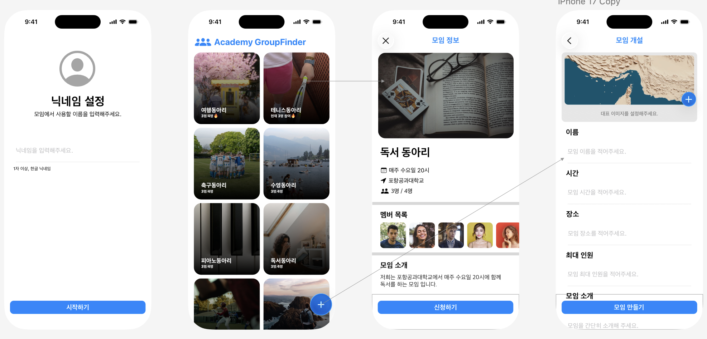
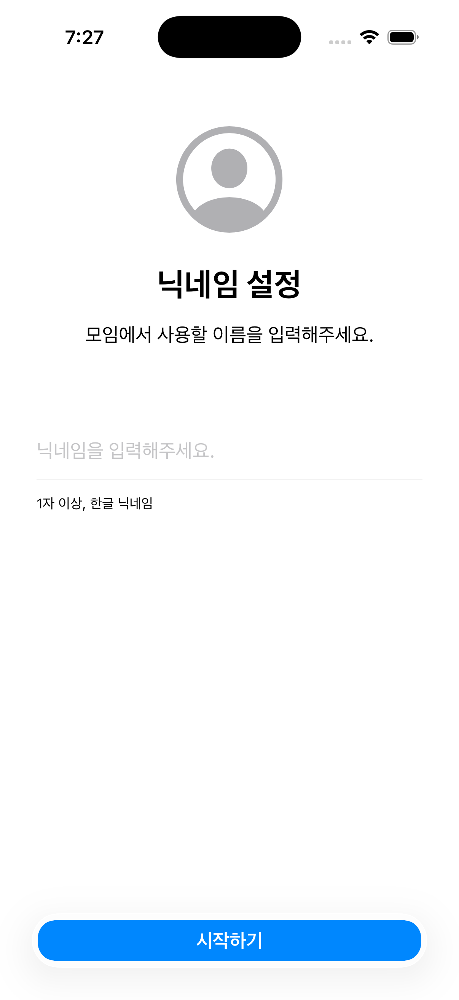
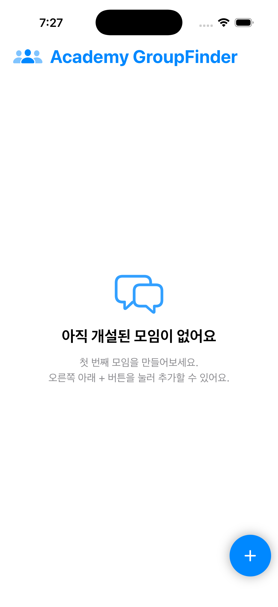
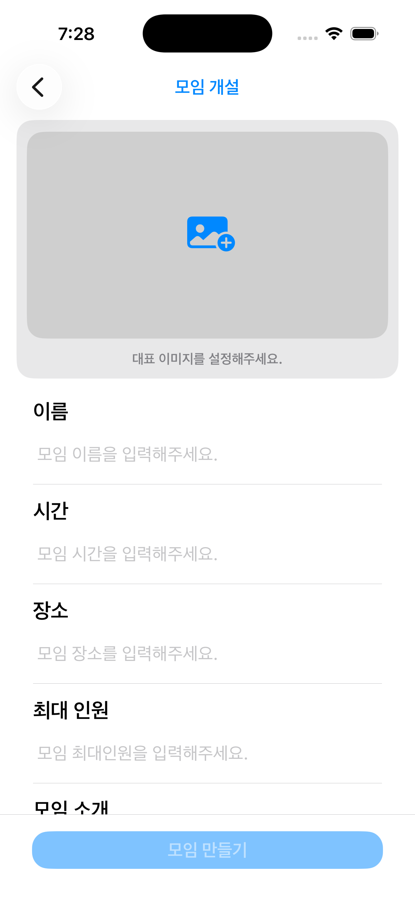
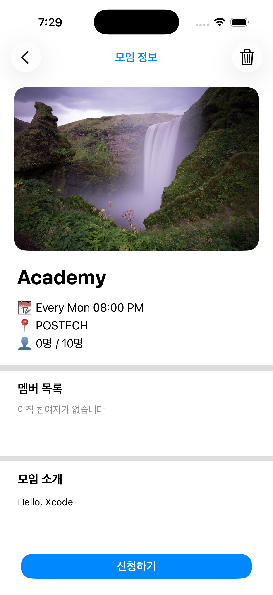

# ADA Challenge2 - Academy GroupFinder

## 프로젝트 소개

`Academy GroupFinder`는 아카데미 러너들이 관심 있는 모임을 개설하고, 탐색하고, 신청할 수 있도록 만든 SwiftUI 기반 iOS 앱입니다.  
Challenge2에서는 단순히 기능을 동작하게 만드는 것을 넘어, 사용자가 실제로 더 자연스럽고 편하게 앱을 사용할 수 있도록 화면 구성과 데이터 흐름을 함께 개선하는 데 집중했습니다.

## Challenge2 시작 전

- 기존 Challenge1의 앱은 세부 기능을 구현하기 위한 로직 구현에 집중되어 있었습니다.
- UX/UI를 충분히 고려하지 못해 화면 구성과 디자인 측면에서 아쉬움이 남아 있었습니다.

## Challenge Response

### 1. 기능

- `SwiftData`를 적용해 모임 데이터를 저장하고 불러오는 구조를 학습했습니다.
- 모임 개설 시 사용자의 갤러리에서 이미지를 불러올 수 있도록 `PhotosPicker`를 적용했습니다.
- 저장된 이미지를 홈 화면과 상세 화면에서 다시 불러와 보여주는 흐름을 구현했습니다.
- 기존 `Binding` 중심 구조를 `SwiftData`의 컨테이너와 컨텍스트 기반 구조로 전환하며 데이터 관리 방식을 개선했습니다.

### 2. UX/UI

- 사용자 닉네임을 입력받는 화면을 새롭게 구성해 앱 진입 경험을 정리했습니다.
- 홈 화면, 디테일 뷰, 모임 개설 화면을 사용자 친화적으로 다시 설계하며 UX/UI를 학습했습니다.
- 모임이 없을 때의 빈 상태 화면, 상세 정보 구성, CTA 버튼 배치 등 사용자 흐름이 더 자연스럽게 이어지도록 화면을 정리했습니다.

## 폴더 구조

```bash
ADA_Challenge2/
├── challenge2/
│   ├── challenge2App.swift          # 앱 진입점, 닉네임 저장 여부에 따라 첫 화면 분기
│   ├── ContentView.swift            # 홈 화면, 저장된 모임 목록을 2열 카드 형태로 표시
│   ├── NicknameSetupView.swift      # 사용자 닉네임 설정 화면
│   ├── AddClubView.swift            # 모임 개설 화면, 사진 선택 및 입력값 검증 처리
│   ├── ClubDetailView.swift         # 모임 상세 화면, 신청/취소/삭제 기능 담당
│   ├── ClubThumbnailView.swift      # 모임 대표 이미지를 렌더링하는 공통 썸네일 뷰
│   ├── ClubUserPic.swift            # 참여자 프로필 이미지를 표시하는 보조 뷰
│   ├── Club.swift                   # SwiftData 기반 모임 데이터 모델
│   ├── ClubData.swift               # 프리뷰 및 테스트용 샘플 모임 데이터
│   └── Assets.xcassets/             # 앱 아이콘, 기본 이미지, 사용자 이미지 에셋
├── challenge2.xcodeproj/            # Xcode 프로젝트 파일
└── readme.md                        
```

## 데이터 구조

이 프로젝트는 `Club` 모델을 중심으로 모임 데이터를 관리합니다.  
`SwiftData`를 통해 모임 생성, 조회, 수정, 삭제 흐름을 구성했고, 대표 이미지는 `Data?` 형태로 저장해 실제 사진 데이터를 다룰 수 있도록 했습니다.

```swift
@Model
class Club: Identifiable {
    let id = UUID()
    var clubName: String
    var clubTime: String
    var clubPlace: String
    var clubDescription: String
    var clubOwner: String
    var maxMembers: Int
    var members: [String]
    var clubImage: Data?
}
```

- `clubName`, `clubTime`, `clubPlace`, `clubDescription`: 모임의 기본 정보
- `clubOwner`: 모임을 개설한 사용자 닉네임
- `maxMembers`: 최대 모집 인원
- `members`: 현재 참여 중인 사용자 목록
- `clubImage`: 갤러리에서 선택한 대표 이미지 데이터

Challenge1에서 문자열 기반 이미지 참조를 사용했던 방식과 달리, Challenge2에서는 실제 사진 데이터를 저장하는 구조로 변경했습니다.  
이를 통해 사용자가 갤러리에서 선택한 이미지를 홈 화면과 상세 화면에서 그대로 재사용할 수 있도록 했습니다.

## 구현 포인트

- `@AppStorage`를 사용해 사용자 닉네임을 로컬에 저장하고, 앱 재실행 시에도 유지되도록 구성했습니다.
- `SwiftData`의 `@Model`, `@Query`, `modelContext`를 활용해 모임 데이터를 저장하고 화면에 반영했습니다.
- `PhotosPicker`를 적용해 사용자가 갤러리에서 직접 대표 이미지를 선택할 수 있도록 구현했습니다.
- 홈 화면에서는 카드형 레이아웃과 그라데이션 오버레이를 활용해 모임 정보가 한눈에 들어오도록 구성했습니다.
- 상세 화면에서는 신청, 취소, 삭제 흐름을 사용자 상태에 따라 분기 처리해 예외 상황을 명확하게 안내했습니다.
- 빈 상태 화면, 하단 CTA 버튼, 입력 검증 알림 등을 통해 사용자 흐름이 자연스럽게 이어지도록 UX를 다듬었습니다.

## 화면 구성

### 1. 닉네임 설정 화면

- 앱 실행 시 가장 먼저 보여지는 화면입니다.
- 사용자는 모임에서 사용할 닉네임을 입력한 뒤 앱을 시작할 수 있습니다.
- 한글만 입력 가능하도록 조건을 두고, 잘못된 입력은 알림으로 안내합니다.
- 입력이 완료되면 `@AppStorage`에 닉네임이 저장되어 이후 화면 분기에 활용됩니다.

### 2. 홈 화면

- `SwiftData`에 저장된 모임 목록을 `@Query`로 불러와 2열 카드 레이아웃으로 보여줍니다.
- 각 카드에는 대표 이미지, 모임 이름, 현재 참여 인원이 함께 표시됩니다.
- 등록된 모임이 없는 경우 빈 상태 메시지를 보여주어 다음 행동을 유도합니다.
- 우측 하단의 `+` 버튼을 통해 모임 개설 화면으로 이동할 수 있습니다.

### 3. 모임 상세 화면

- 대표 이미지, 시간, 장소, 인원 정보, 모임 소개를 구분된 영역으로 배치했습니다.
- 현재 사용자가 이미 신청했는지에 따라 `신청하기`와 `취소하기` 버튼이 달라집니다.
- 개설자는 신청할 수 없고, 정원이 가득 찬 경우에도 알림을 통해 예외 상황을 안내합니다.
- 개설자 본인만 모임 삭제가 가능하도록 분기 처리했습니다.

### 4. 모임 개설 화면

- 사용자는 갤러리에서 대표 이미지를 선택하고, 모임 이름, 시간, 장소, 최대 인원, 소개를 입력할 수 있습니다.
- 모든 입력값이 채워졌는지 확인하고, 최대 인원은 숫자 형식으로 검증합니다.
- 입력 완료 후 `SwiftData`에 새 모임을 저장하고, 홈 화면에서 바로 확인할 수 있도록 연결했습니다.

## Sketch 기반 HI-FI

Challenge2에서는 단순 구현을 넘어 화면의 완성도를 높이기 위해 `Sketch`를 활용한 HI-FI 시안도 함께 고민했습니다.  
실제 구현 과정에서는 기술적 한계로 HI-FI를 완전히 동일하게 재현하지는 못했지만, 화면의 위계, 정보 배치, 버튼 위치, 카드형 구성 등을 설계하는 기준점으로 활용했습니다.

| |
|---|
|  |


## 러닝 커뮤니티에서의 역할

러닝 커뮤니티에서 저는 **게슈탈트 원칙의 수호자** 역할을 맡았습니다.  
Daily StandUp 시간마다 팀원들의 결과물을 살펴보며, 화면의 요소들이 게슈탈트 원칙을 고려해 구성되어 있는지 함께 확인했습니다.

## 수행 결과

이번 경험을 통해 앱 화면의 각 요소가 어떤 게슈탈트 원칙에 기반해 구성되었는지 분석하는 능력을 기를 수 있었습니다.  
단순히 화면을 예쁘게 보는 것을 넘어, 왜 그렇게 배치되었는지와 어떤 사용자 경험을 만들어내는지까지 생각해보는 시각을 얻을 수 있었습니다.

## 러닝 커뮤니티 경험이 배움에 준 영향

각자의 프로젝트를 준비하느라 바빠 서로가 맡은 역할을 충분히 돌아보지 못했고, 다른 러너들에게까지 관심을 기울이기 어려웠습니다.  
그럼에도 Daily StandUp을 통해 서로의 아이디어를 짧게나마 공유하면서 자신의 생각을 정리할 수 있었고, 세션 시작 전에 오늘 무엇을 할지 다시 되새길 수 있어 좋았습니다.

또한 자신에게 필요한 기능을 먼저 구현한 러너에게 도움을 구하고, 서로의 지식을 나누는 과정에서 협업의 의미를 더 깊이 느낄 수 있었습니다.  
혼자 해결하는 개발이 아니라 함께 배우고 나누는 개발의 즐거움과 뿌듯함도 경험할 수 있었습니다.

## 개발하면서 힘들었던 점과 극복 과정

개발 과정에서 가장 힘들었던 점은 **디자인 구현**과 **데이터 구조 변경**이었습니다.

### 1. 디자인 구현

앱의 전체 디자인을 새롭게 잡아야 했을 때는 무엇부터 시작해야 할지 막막했습니다.  
그래서 널리 사용되는 앱들의 디자인을 조사하고 분석한 뒤, 참고할 수 있는 기본 틀을 먼저 만들었습니다.

이후 디자이너 팀원들에게 도움을 구하고, 게슈탈트 원칙을 다시 떠올리며 각 컴포넌트에 어떤 원칙이 적용되는지 생각하면서 화면을 구성했습니다.  
기술적인 한계로 HI-FI를 완전히 구현하지는 못했지만, 대부분의 화면을 직접 구현해내며 큰 성취감을 느꼈고 UX/UI 자체에 대한 흥미도 커졌습니다.

### 2. 데이터 구조 변경

또 다른 어려움은 기존의 `Binding` 기반 구조를 `SwiftData`의 컨테이너와 컨텍스트 방식으로 바꾸는 과정이었습니다.  
이미 작성된 코드를 수정하는 일은 쉽지 않았지만, 그 과정에서 코드 한 줄 한 줄이 어떻게 연결되는지 더 깊이 이해할 수 있었습니다.

특히 이미지를 심볼이 아닌 실제 사진과 `PhotoPicker` 데이터로 다루게 되면서 이미지 처리 방식까지 새롭게 익혀야 했고, 많은 시행착오를 겪었습니다.
아직 `SwiftData`를 완전히 이해했다고 보기는 어렵지만, 이번 경험을 통해 앱의 전체 구조를 설계하는 감각은 분명히 키울 수 있었습니다. 앞으로는 부족하다고 느낀 문법과 세부 구현 능력을 더 보완해나가고 싶습니다.

## 사용 기술

- SwiftUI
- SwiftData
- PhotosUI
- AppStorage
- Xcode

## 스크린샷

| | | | | |
|---|---|---|---|---|
|  |  |  |  |  |

---

# ADA Challenge2 - Academy GroupFinder

## Project Introduction

`Academy GroupFinder` is a SwiftUI-based iOS app designed to help Academy learners create, explore, and apply to interest-based groups.  
In Challenge2, I focused not only on making features work, but also on improving the screen structure and data flow so that users can interact with the app more naturally and comfortably.

## Before Challenge2

- The existing Challenge1 app focused mainly on implementing logic for detailed features.
- There were still areas for improvement in terms of screen structure and design because UX/UI had not been fully considered.

## Challenge Response

### 1. Features

- I learned how to store and load group data by applying `SwiftData`.
- I applied `PhotosPicker` so that users can select images from their gallery when creating a group.
- I implemented a flow that allows saved images to be loaded again and displayed on the home screen and detail screen.
- I improved the data management structure by changing the previous `Binding`-centered structure into a `SwiftData` container and context-based structure.

### 2. UX/UI

- I newly designed a screen where users can enter their nickname, organizing the app entry experience.
- I redesigned the home screen, detail view, and group creation screen in a more user-friendly way while learning UX/UI.
- I improved the user flow by refining the empty state screen, detail information layout, CTA button placement, and other screen elements.

## Folder Structure

```bash
ADA_Challenge2/
├── challenge2/
│   ├── challenge2App.swift          # App entry point, branches the first screen depending on whether the nickname is saved
│   ├── ContentView.swift            # Home screen, displays saved group list in a two-column card layout
│   ├── NicknameSetupView.swift      # User nickname setup screen
│   ├── AddClubView.swift            # Group creation screen, handles photo selection and input validation
│   ├── ClubDetailView.swift         # Group detail screen, handles apply/cancel/delete features
│   ├── ClubThumbnailView.swift      # Common thumbnail view that renders the group representative image
│   ├── ClubUserPic.swift            # Supporting view that displays participant profile images
│   ├── Club.swift                   # SwiftData-based group data model
│   ├── ClubData.swift               # Sample group data for previews and testing
│   └── Assets.xcassets/             # App icon, default images, and user image assets
├── challenge2.xcodeproj/            # Xcode project file
└── readme.md                        
```

## Data Structure

This project manages group data around the `Club` model.  
Using `SwiftData`, I structured the flow for creating, reading, updating, and deleting groups. The representative image is stored as `Data?`, allowing the app to handle actual photo data.

```swift
@Model
class Club: Identifiable {
    let id = UUID()
    var clubName: String
    var clubTime: String
    var clubPlace: String
    var clubDescription: String
    var clubOwner: String
    var maxMembers: Int
    var members: [String]
    var clubImage: Data?
}
```

- `clubName`, `clubTime`, `clubPlace`, `clubDescription`: Basic information about the group
- `clubOwner`: Nickname of the user who created the group
- `maxMembers`: Maximum number of members
- `members`: List of users currently participating
- `clubImage`: Representative image data selected from the gallery

Unlike Challenge1, where images were referenced using strings, Challenge2 changed the structure to store actual photo data.  
This allows images selected by the user from their gallery to be reused on both the home screen and the detail screen.

## Implementation Points

- Used `@AppStorage` to store the user nickname locally and maintain it even after restarting the app.
- Used SwiftData’s `@Model`, `@Query`, and `modelContext` to save group data and reflect it on the screen.
- Applied `PhotosPicker` so users can directly select a representative image from their gallery.
- Used a card layout and gradient overlay on the home screen so that group information can be understood at a glance.
- On the detail screen, the apply, cancel, and delete flows are handled differently depending on the user’s status, clearly guiding exceptional cases.
- Refined the UX flow with an empty state screen, bottom CTA button, and input validation alerts.

## Screen Structure

### 1. Nickname Setup Screen

- This is the first screen shown when the app launches.
- Users can enter the nickname they will use in groups before starting the app.
- Only Korean input is allowed, and invalid input is guided through an alert.
- Once the input is completed, the nickname is saved in `@AppStorage` and used for screen branching afterward.

### 2. Home Screen

- The list of groups saved in `SwiftData` is loaded with `@Query` and displayed in a two-column card layout.
- Each card shows the representative image, group name, and current number of participants.
- If there are no registered groups, an empty state message is shown to guide the user’s next action.
- Users can move to the group creation screen through the `+` button at the bottom right.

### 3. Group Detail Screen

- The representative image, time, location, member information, and group introduction are arranged in separated sections.
- The button changes between `Apply` and `Cancel` depending on whether the current user has already applied.
- The group creator cannot apply, and if the group is full, the app guides the exceptional situation through an alert.
- Only the creator of the group can delete the group.

### 4. Group Creation Screen

- Users can select a representative image from the gallery and enter the group name, time, location, maximum number of members, and description.
- The app checks whether all input fields are filled and validates that the maximum number of members is entered in numeric format.
- After input is completed, the new group is saved in `SwiftData` and immediately shown on the home screen.

## Sketch-based HI-FI

In Challenge2, I also worked on a HI-FI design using `Sketch` to improve the completeness of the screens beyond simple implementation.  
Although I could not fully reproduce the HI-FI design in the actual implementation due to technical limitations, I used it as a design reference for visual hierarchy, information layout, button placement, and card-based structure.

| |
|---|
|  |


## Role in the Learning Community

In the learning community, I took on the role of **Guardian of Gestalt Principles**.  
During Daily StandUp, I reviewed the results of team members and checked together whether the screen elements were organized with Gestalt principles in mind.

## Results

Through this experience, I developed the ability to analyze which Gestalt principles are applied to each element on an app screen.  
Rather than simply seeing a screen as visually pleasing, I gained a perspective that considers why elements are arranged in a certain way and what kind of user experience they create.

## How the Learning Community Experience Influenced My Learning

Because everyone was busy preparing their own projects, it was difficult to fully look back on each person’s role and pay attention to other learners.  
Even so, through Daily StandUp, we were able to briefly share each other’s ideas, organize our own thoughts, and remind ourselves of what we planned to work on before each session began.

Also, by asking for help from learners who had already implemented the features I needed and sharing knowledge with one another, I was able to feel the meaning of collaboration more deeply.  
I also experienced the joy and sense of accomplishment of learning and developing together, rather than solving everything alone.

## Difficulties During Development and How I Overcame Them

The most difficult parts of the development process were **design implementation** and **changing the data structure**.

### 1. Design Implementation

When I had to redesign the overall app, I felt lost because I did not know where to start.  
So I researched and analyzed the designs of widely used apps, then first created a basic structure that I could refer to.

After that, I asked designer teammates for help and recalled Gestalt principles while thinking about which principle was applied to each component as I built the screens.  
Although I could not fully implement the HI-FI design due to technical limitations, I felt a great sense of achievement from implementing most of the screens myself, and my interest in UX/UI also grew.

### 2. Changing the Data Structure

Another difficulty was changing the existing `Binding`-based structure into a `SwiftData` container and context-based structure.  
Modifying already written code was not easy, but through the process, I was able to understand more deeply how each line of code was connected.

Especially as I started handling images not as symbols but as actual photos and `PhotoPicker` data, I had to learn a new way of processing images and went through many trials and errors.  
I cannot say that I fully understand `SwiftData` yet, but through this experience, I was definitely able to develop a better sense of how to design the overall structure of an app. Going forward, I want to continue improving the syntax and detailed implementation skills that I still feel lacking.

## Tech Stack

- SwiftUI
- SwiftData
- PhotosUI
- AppStorage
- Xcode

## Screenshots

| | | | | |
|---|---|---|---|---|
|  |  |  |  |  |

---
